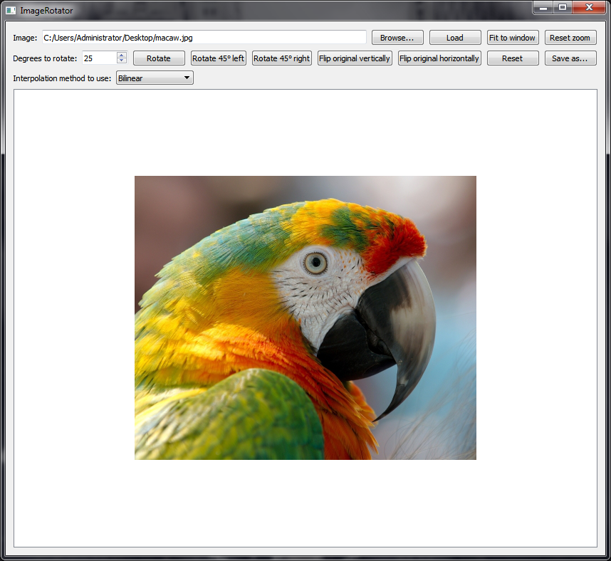
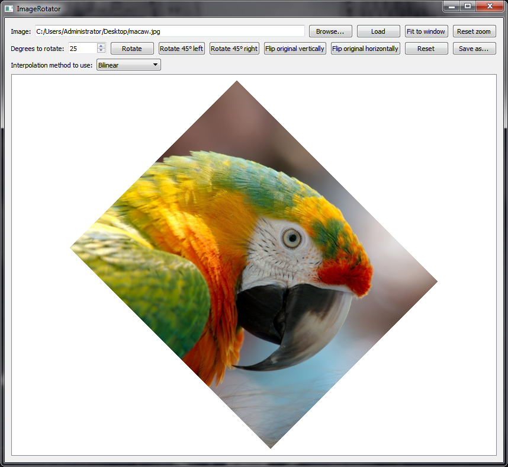

# ImageRotator
Image rotator capable of rotating images using the nearest neighbor and bilinear interpolation algorithms. Written in Qt/C++.

## Download

Download link: [Win32 binary](https://github.com/Extender/ImageRotator/raw/master/bin/imagerotator-v1.0-bin-win32.zip)

## Screenshots

### Input

### Rotated

